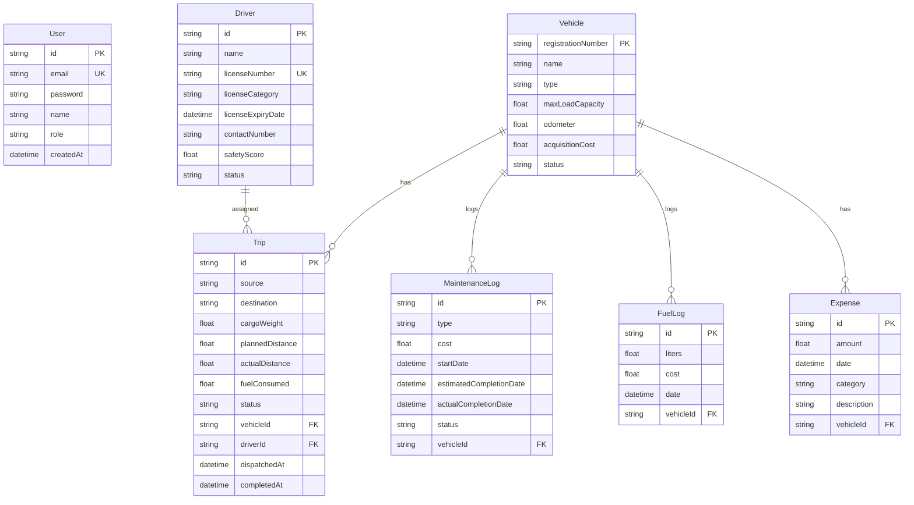

# Database Specification (MySQL)

TransitOps uses a MySQL database managed through Prisma ORM.

## Entity Relationship Summary

## Relational Constraints

1.  **Vehicle Status Constraints**:
    *   Vehicles status = `In Shop` when an active `MaintenanceLog` is opened.
    *   Vehicles status = `On Trip` when assigned to a dispatched `Trip`.
2.  **Driver Status Constraints**:
    *   Drivers status = `On Trip` when assigned to a dispatched `Trip`.
    *   Drivers with `Suspended` status or expired `licenseExpiryDate` cannot be assigned to any `Trip`.
3.  **Cascade Behavior**:
    *   Foreign keys refer to unique constraints (e.g., `vehicleId` maps to `Vehicle.registrationNumber`).
    *   Deletes are restricted if dependent references exist (e.g., cannot delete a vehicle with active trips).
